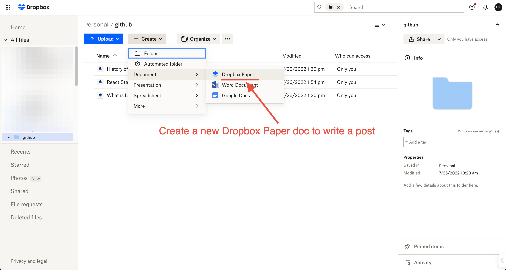
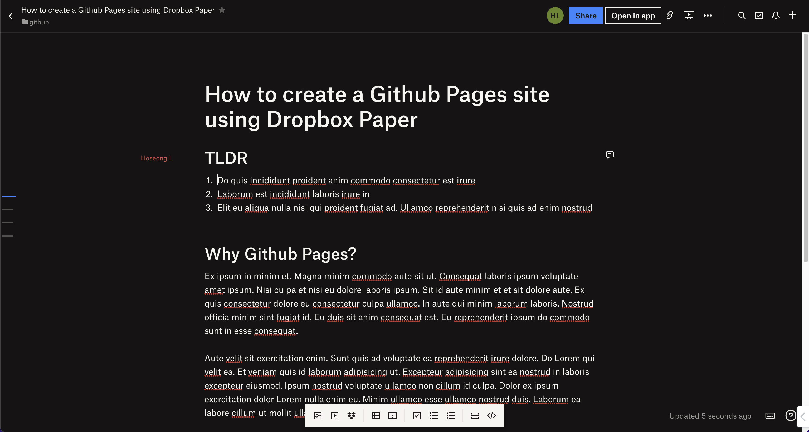
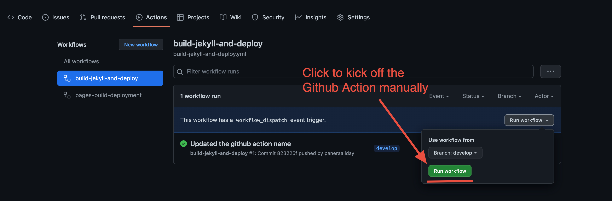

# Github Pages with Dropbox Paper
Github Pages with Dropbox Paper allows creating a blog using [Dropbox Paper] and [Github Pages].
Users can create blog contents using [Dropbox Paper], and can deploy the contents to a [Github Pages] site with
automated job using [Github Action].

# How to set up
1. Click the button `Use this template` to create a new repo for your [Github Pages] site.
2. [Create a Dropbox app through App Console][Create Dropbox App]
3. [Create a long-lived refresh token for the Dropbox app][Create Refresh Token]
4. [Configure Github Action secrets][Configure Github Action Secrets]

# How to write a post
Use [Dropbox Paper] to create a post. As long as the post is under the
folder whose `path` is configured in the [Github Action] secrets
(`DROPBOX_GITHUB_PAGES_FOLDER)`, the [Github Action] job will be able to
export the docs and deploy those to the [Github Pages] site.

<p align="center">
    
</p>

<p align="center">
    
</p>

# How to build and deploy
Once you added a new [Dropbox Paper] doc or updated an existing one, you need to 
build and deploy the posts to the [Github Pages] site. The build and deploy is
done through the pre-configured [Github Action] build job.

The [Github Action] job is configured to kick off whenever the `develop` branch is updated. However, you can also manually
run in the `build-jekyll-and-deploy` job in the `Actions` tab. Once all builds are completed, you can access to the [Github Pages] site
to see the changes.

<p align="center">
    
</p>

# How to test it locally
To run your [Github Pages] site locally, you need to have [Ruby] and [Node.js] environments set up. And, to generate static site assets,
you also need [Jekyll] set up as well. Check out this document [Jekyll Quickstart] to configure

```bash
# 1. export Dropbox Paper docs
npm run build

# 2. build static site assets using Jekyll
jekyll serve

# 3. Go to http://localhost:4000
```

# License
[MIT License]

[Github Pages]: https://pages.github.com
[Dropbox Paper]: https://www.dropbox.com/paper
[Github Action]: https://github.com/features/actions
[App Console]: https://www.dropbox.com/developers/apps?_tk=pilot_lp&_ad=topbar4&_camp=myapps
[Jekyll]: https://jekyllrb.com/
[Jekyll Quickstart]: https://jekyllrb.com/docs/
[Node.js]: https://nodejs.org
[Ruby]: https://www.ruby-lang.org/
[Create Dropbox App]: docs/dropbox-app.md
[Create Refresh Token]: docs/refresh-token.md
[Configure Github Action Secrets]: docs/github-action-secrets.md
[MIT License]: LICENSE
