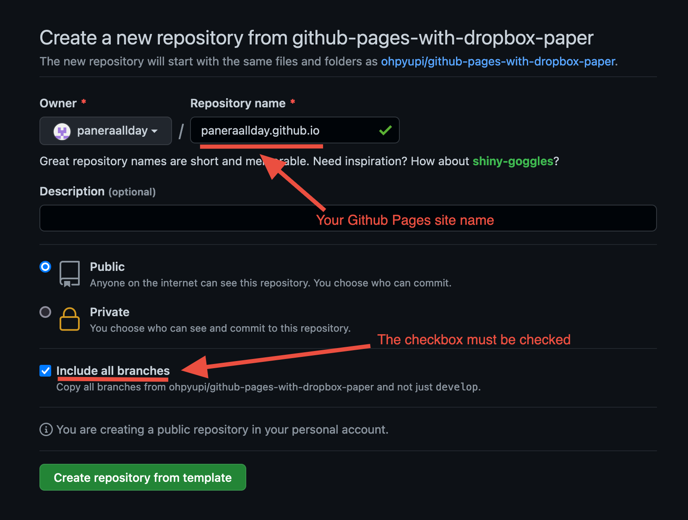

# Create a new Github Pages repository

Click the `Use this template` button to create a new [Github Pages] repo.

    

On the next screen, you will set some initial configuration of the repo.
Set the repo name to be `${github_username}.github.io`. It will be the
hosting URL of your Github Pages site.

Also, check the checkbox `Include all branches`.

    

Once the repo is created, go to the `Github Pages` setting page
(`Settings` -> `Pages`). And select `gh-pages` to be the source branch
of your [Github Pages] site.

    

Now, your repository is all set up!

[Github Pages]: https://pages.github.com
