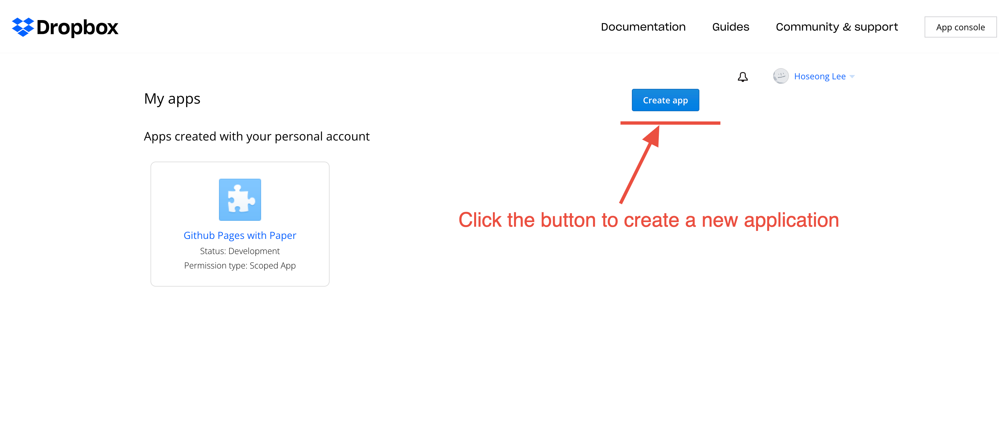
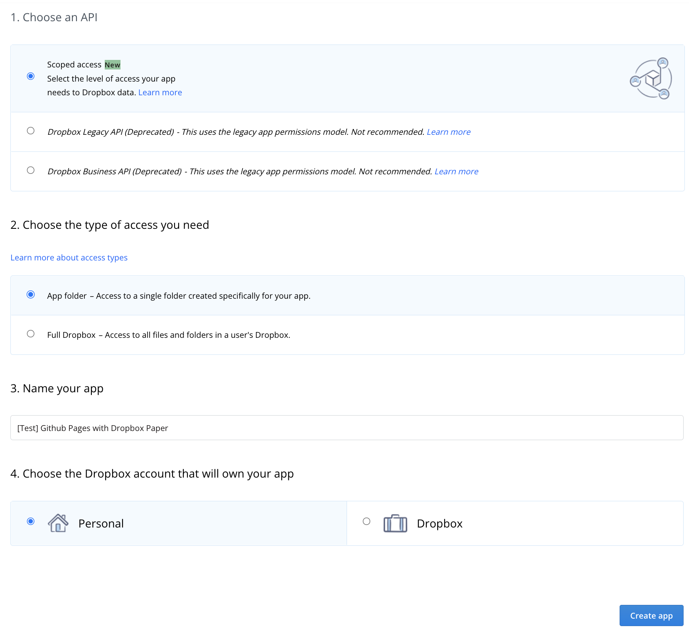
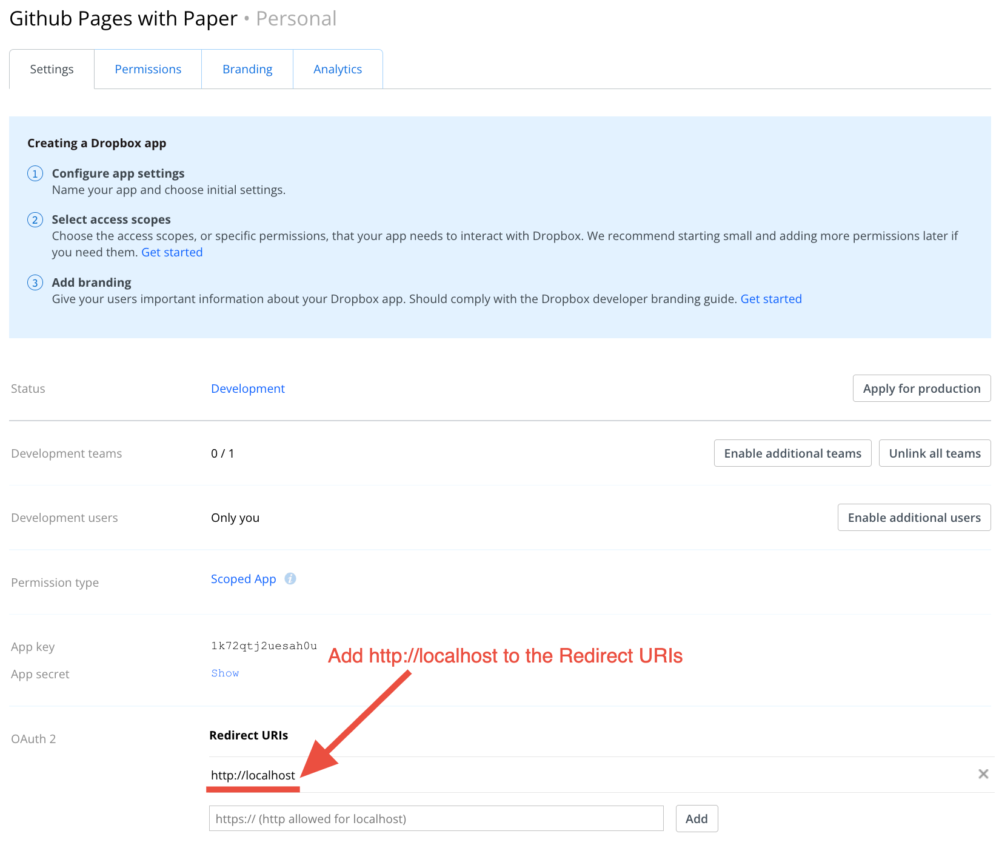
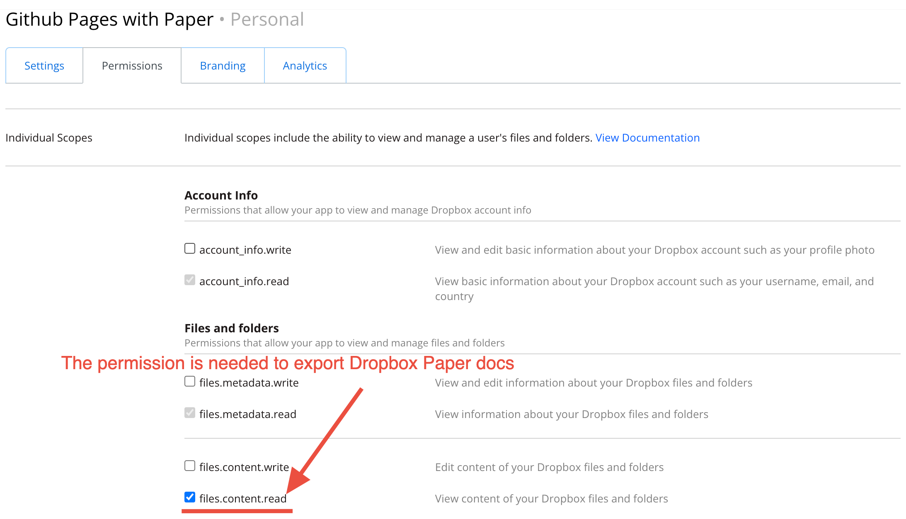

# Create a Dropbox application

To create a new Dropbox application, go to [App Console], and click the `Create app` button.

    

On the next screen, you will be asked to select app configurations, `scope`,
`access type`, `app name`, and `your Dropbox account` (only for users who linked Dropbox accounts).

Select the configurations like the below screenshot, and click `Create app` button once all is done.

    

Go to `Settings` tab, and add "http://localhost" to the `Redirect URIs` section. The redirect URI
will be used when minting authorization code and long-lived refresh token later.

    

Go to `Permission` tab, and check the permission `files.content.read`. This permission is needed
to export [Dropbox Paper] docs.

    

Now, you're all set with the Dropbox app configuration!

[App Console]: https://www.dropbox.com/developers/apps
[Dropbox Paper]: https://www.dropbox.com/paper
