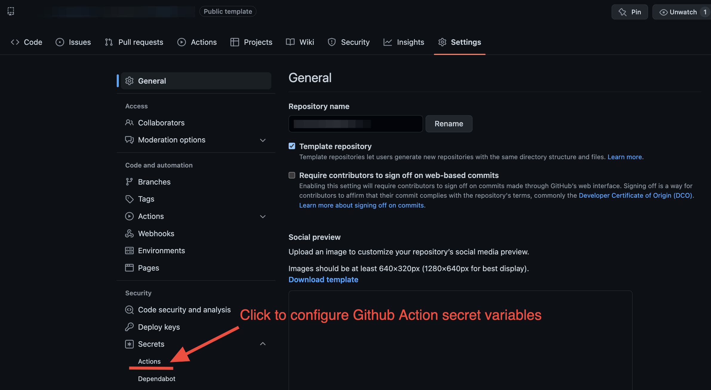
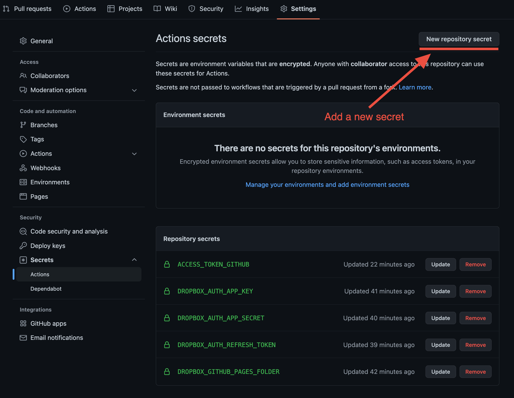

# Configure secrets for Github Action
[Github Action] job runs to build and deploy your blog to a [Github Pages] site.
To let the job working, you need to provide some secret variables for your Dropbox
application, Github account, and Github repository.

On your repository's `Settings` page, you can find `Secrets` dropdown menu.
And on the dropdown menu, if you click `Actions` menu, you can navigate to `Actions secrets` page.

    

On the `Actions secrets` page, you can add new secret variables that will
be accessed by the [Github Action] job.

    

See the table below to check out details about secrets.

| Secret                        | Description                                                                                                                                                                                       |
| ----------------------------- |---------------------------------------------------------------------------------------------------------------------------------------------------------------------------------------------------|
| `DROPBOX_AUTH_APP_KEY`        | Your Dropbox application’s client ID. You can find it in [App Console].                                                                                                                           |
| `DROPBOX_AUTH_APP_SECRET`     | Your Dropbox application’s client secret. You can find it in [App Console].                                                                                                                       |
| `DROPBOX_AUTH_REFRESH_TOKEN`  | Your Dropbox application’s long-lived refresh token. Follow instruction [here](refresh-token.md) to generate the token.                                                                           |
| `DROPBOX_GITHUB_PAGES_FOLDER` | It’s the path of the folder you have your Dropbox Paper docs to export to Github Pages site. For example, `/github_pages`.                                                                        |
| `ACCESS_TOKEN_GITHUB`         | A personal access token for your Github account. Check out [this doc][Github Personal Access Token]for instruction. Allow the `repo` access to the token, and Note set the indefinite expiration. |

Once all secrets are provided, your [Github Action] is all set for build and deploy!

[Github Pages]: https://pages.github.com
[Github Action]: https://github.com/features/actions
[App Console]: https://www.dropbox.com/developers/apps
[Github Personal Access Token]: https://docs.github.com/en/authentication/keeping-your-account-and-data-secure/creating-a-personal-access-token
