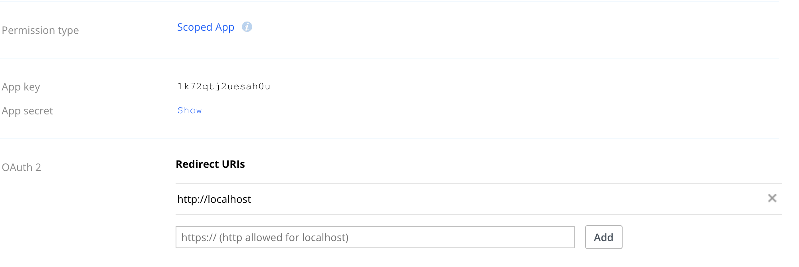
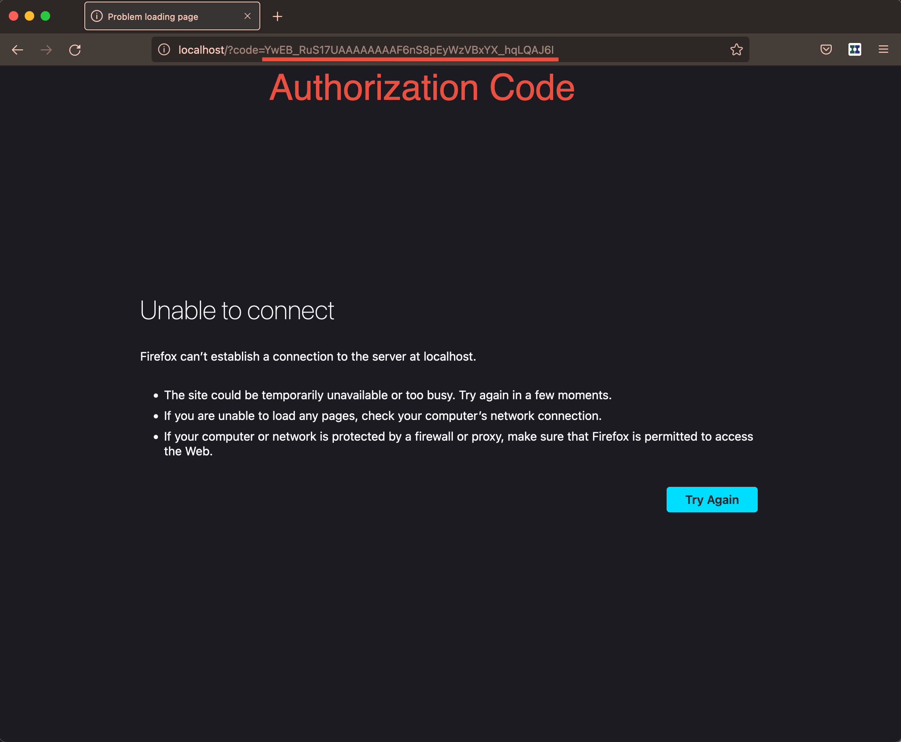

# Create a Dropbox long-lived refresh token

In order to fetch [Dropbox Paper] docs in the [Github Action] job, you need
to have an access token for the Dropbox account. But access token is short-lived token,
and it cannot be used permanently.

Hence, a long-lived refresh token should be provided to the [Github Action] job. And below outlines
how to receive a long-lived refresh token.

### 1. Get an authorization with `offline` access

Dropbox API allows offline applications to generate long-lived refresh token.
By passing `token_access_type=offline` parameter to its authorization URL, we can
mint an authorization that can be exchanged for a long-lived refresh token.

To generate an authorization code, navigate to the following URL:

```bash
https://www.dropbox.com/oauth2/authorize?client_id=${DROPBOX_AUTH_APP_KEY}&redirect_uri=${DROPBOX_AUTH_REDIRECT_URI}&response_type=code&token_access_type=offline
```

| Parameters        | Description                                                                                                                                                                       |
| ----------------- |-----------------------------------------------------------------------------------------------------------------------------------------------------------------------------------|
| client_id         | It is the client ID of your Dropbox application. It can be found in the [App Console] (see Figure 1)                                                                              |
| redirect_uri      | It’s URI you will be redirected to after successful authorization code flow. You can set it in the App Console (see Fig. 1). And it’s recommended to set it to `http://localhost`. |
| response_type     | its value must be `code` to generate an authorization code.                                                                                                                       |
| token_access_type | Its value must be `offline` to generate a long-lived refresh token,                                                                                                               |

After completing the auth code flow, you will be redirected to `http://locahost` and you will be able to find
an authorization code attached to the URL.

<p align="center">
    
    <figcaption>
        Figure 1. App key and App secret can be found in your Dropbox app’s
        App Console. You can also set Redirect URIs for auth code flows.
    </figcaption>
</p>

<p align="center">
    
    <figcaption>
        Figure 2. After successful auth code flow, you will be redirected to the "redirect_uri"
        you provided in the App Console, which contains an authorization code.
    </figcaption>
</p>

## 2. Exchange the auth code for a long-lived refresh token
With the auth code on your hand, now you can generate a long-lived refresh token.
Run the below `curl` command with parameters.

```bash
curl -XPOST -H 'Content-Type: application/x-www-form-urlencoded' 'https://api.dropboxapi.com/oauth2/token' \
-d "grant_type=authorization_code" \
-d "client_id=${DROPBOX_AUTH_APP_KEY}" \
-d "client_secret=${DROPBOX_AUTH_APP_SECRET}" \
-d "redirect_uri=${DROPBOX_AUTH_REDIRECT_URI}" \
-d "code=YwEB_RuS17UAAAAAAAAF667_uM7SQqrrRurkjwEJcx8"

```
| Parameters    | Description                                                                           |
| ------------- |---------------------------------------------------------------------------------------|
| grant_type    | Its value must be `authorization_code`.                                               |
| client_secret | It’s a secret of your Dropbox app. You can find it in the App Console (See Figure 1). |
| code          | It’s the authorization code you generated in the previous step.                       |

If the call is successful, the response will contain both `access_token` and `refresh_token`.
With long-lived `refresh_token`, you can generate multiple short-lived access tokens.

```json
{
   "access_token":"sl.BMLkoiK62w0oFJOeG0DAh_tyPT3yViSz1plMQkFpQ_DABQz3NIdk7YO84PV9INBvI3GxdkBSbrka68H_X9570mB6YlixnJ60Ok-k-t3lrb42ye38AJ2g5nRKwoSJX_G4hHx5EfY",
   "token_type":"bearer",
   "expires_in":14400,
   "refresh_token":"60bP6oNVLtYAAAAAAAAAASaCQdnK5EPf2F6ht8_Xa1Tuq8rfYdAZaBk31NoTR1H2",
   "scope":"account_info.read files.content.read files.metadata.read",
   "uid":"230892969",
   "account_id":"dbid:AABy_V-QKwphvJPrwrssV-rriY6LA6yp6vw"
}
```


[App Console]: https://www.dropbox.com/developers/apps?_tk=pilot_lp&_ad=topbar4&_camp=myapps
[Dropbox Paper]: https://www.dropbox.com/paper
[Github Action]: https://github.com/features/actions
